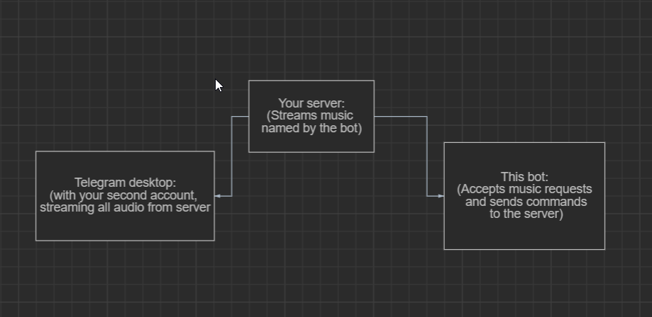

# NEUTRON

NEUTRON Bot To Play Music From Various Sources In Your Group... Fork of [this epic bot](https://github.com/thehamkercat/Telegram_VC_Bot)
This bot is same as Telegram VC Bot.... But without youtube command as jiosaavn as better quality as well as I think indeed it is not needed... [And with admins feature... You can choose who can use your bot... this will come soon... lol]

# Support

1. All linux based oses
2. Windows

# Diagram

## Requirements

- Python 3.6 or higher
- A [Telegram API key](//docs.pyrogram.org/intro/setup#api-keys)
- A [Telegram bot token](//t.me/botfather)
- Bot needs to be admin in the chat, atleast give message delete permissions.
- Install `mpv` with

`pkg install mpv` - for Android,  `sudo apt-get install mpv` - for ubuntu, `sudo pacman -S mpv `  - for ArchLinux, I use UBUNTU 20.04

## Run

1. `git clone https://github.com/thehamkercat/Telegram_VC_Bot`, to download the source code.
2. `cd Telegram_VC_Bot`, to enter the directory.
3. `pip3 install -r requirements.txt`, to install the requirements.
4. `cp sample_config.py config.py`
5. Edit `config.py` with your own values.
6. If you are on linux follow [this](https://github.com/thehamkercat/Telegram_VC_Bot/blob/master/vnc.md) 
instruction to set up vnc. If you are using windows you can skip this step.
6. Download Telegram desktop from https://desktop.telegram.org , Log in using your second account, and connect 
to 
the 
voice chat in your group.
7. Follow [This](https://unix.stackexchange.com/questions/82259/how-to-pipe-audio-output-to-mic-input) to route 
your PC or Server's audio output to audio input. [For Linux]
8. If you're on windows, Follow 
[This](https://superuser.com/questions/1133750/set-output-audio-of-windows-as-input-audio-of-microphone) instead.
9. Run the bot `python3 main.py`
10. Open Telegram and start voice chat.
11. Send [commads](https://github.com/thehamkercat/Telegram_VC_Bot/blob/master/README.md#commands) to bot to 
play music.

## Commands
Command | Description
:--- | :---
/help | Show help screen.
/end | Stop any playing music. 
/jiosaavn <song_name> | Play music from JioSaavn.
/youtube <song_name> or <song_link>| Search for a song and play the top-most one or play with a link.
/playlist <youtube_playlist_link> | Play a all videos in a youtube playlist.
/telegram | Play a song from telegram file.
/radio | Play radio continuosly.
/black | Blacklist a user.
/white | Whitelist a user.
/users | Get a list of blacklisted users.

## Note

1. More services will be added soon.
2. Termux is not completely supported yet, might take a week or two.

## Credits
1. `https://github.com/cyberboysumanjay/JioSaavnAPI` [For JioSaavnAPI]
